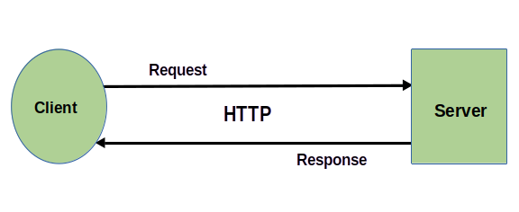
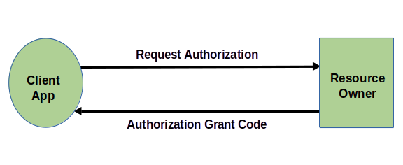
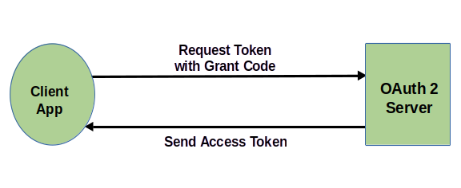
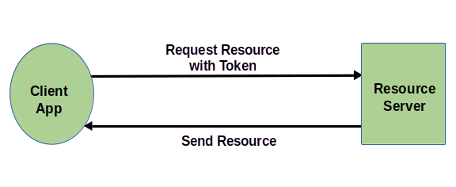

# hubspot-crm-api-draft1.md
(File name is above. The next heading is the title.)
Target audience: Mid-level to exec-level technical and business managers

# REST APIs Drive Business Tools  

>**Note:**  
>This is article is re-targeted to API-centric business tools from the original Music Database API article submitted to Linux Magazine.

## Overview

Businesses are becoming increasingly dependent on network-based software tools (applications) from front-end e-commerce applications to back-end databases. In the past, these applications were used in isolation. Occasionally, data would be exchanged manually between tools in various file formats that both applications could understand.  

Developers have traditionally automated some of these application-to-application exchanges by developing custom interfaces called application programming interfaces (API) between the applications. As the number of different applications grows however, so does complexity. Maintaining compatibility can become problematic due to multiple factors including version changes, feature enhancements, etc.

With the current proliferation of network-based APIs, applications can leverage standardized internet protocols like HTTP and adopt the client-server model. (Figure 1) The type of business applications embracing network-based applications include:  

* CRM (customer relationship management)  
* CMS (content management system)  
* Data warehouse  
* e-commerce  
* ETL  
* Marketing automation  
* Sales automation  

These tools all serve to automate processes that are often done manually. Connecting these tools to create a single unified database can be challenging since they produce data in incompatible formats and/or inconsistent schemas.  

Many network-based applications feature APIs that comply with the REpresentational State Transfer (REST) design style. [1] APIs that comply with the REST design style are called RESTful. REST APIs operate in request and response modes where the client sends a request to the server for data, and the server responds with a status code, and if appropriate, the requested data.  

  
Figure 1. Client-server model 

## RESTful component isolation  

For developers, one benefit of using a RESTful API is that you don't need to know the details of the implementation on either side of the API. Client and server can be implemented in the same or different languages without any impact on the result. This enables development and maintenance on either side to happen independently as long as the interface protocol is followed.  

## Standard protocols

RESTful APIs are attractive because they leverage existing HTTP infrastructure, the same infrastructure and protocols that browsers use. As a result, lots of supporting resources (applications, libraries, developers, etc.) are available.  

Let's look at how REST APIs leverage HTTP. The Hypertext Transfer Protocol (HTTP) is a stateless application-level protocol for distributed, collaborative, hypertext information systems. [2] It is the predominant protocol used on the internet today. It was designed from its beginning to support the client-server model in which a request is sent from a client to a server in the form of a message. The server then sends a response message and status code back to the client.  

**Requests**   
   
When a request message is sent by a user agent (the client application) to a server, the message typically contains header fields that can include metadata such as: method, target host name, content type, content length, and/or other characteristics of the client, host, or message being sent.  

**Responses**  

Upon receiving a request from a user agent, the server determines whether it can accept the request. If accepted, the server responds by sending a status code and a message back to the client. Response message content might include metadata and/or the requested target resource.  

**HTTP methods**  

  
Table 1. HTTP Methods  

REST constraints require the API to be stateless. This means that each request sent by the client to the server must contain all the information the server needs to respond appropriately. As a consequence, everything is contained in the HTTP message. [1]  

In a RESTful web service, requests made to a resource's URI elicit a response with a payload usually formatted in HTML, XML, or JSON. The most common data transfer protocol for these requests and responses is HTTP, which provides operations (HTTP methods) such as GET, POST, PUT, PATCH and DELETE.  


## Authentication and authorization    

For security, CRM APIs require robust authentication and authorization to verify that the client submitting a request is authorized to do so. Authentication is the process of verifying the identity of a user. Authorization on the other hand, is a means of controlling access.  

The most common authentication protocols are HTTP Digest Access Authentication and JSON Web Token (JWT). HTTP Digest Access Authentication uses 256 or 512 hash encrypted username and password to authorize access. JWT tokens are often generated by a third party authorization server, that you authorize in advance to give you access to one or more applications. Open authorization (OAuth) is a popular protocol for controlling access to online web services. OAuth 2.0-- also referred to as OAuth2--is often used in conjunction with authentication protocols. [3] OAuth2 uses access to give a client access to a server. The token approach effectively gives you secure authorization without giving your username and password to the web service since the trusted third party has already authenticated your identity.  

## CRM example    

Customer data is critical for businesses to grow and thrive. For that reason, I'll use a customer relationship management (CRM) application as an example of a typical business related REST API application. In our example, we will use the HubSpot REST API to access a CRM database.  

## Authorization flow  

HubSpot supports the OAuth 2 protocol for secure authorization access. While the protocol supports multiple grant types, HubSpot supports the OAuth 2.0 Authorization Code grant type. The process [4] to obtain access permission can be broken down into these basic steps.  

**Step 1.**  

Get authorization for your client app from the resource owner. The resource owner in this case would be someone who has authority to grant access to the CRM database. (See figure 2.) The client app receives a grant code.  

* Your client app sends a grant request to the resource owner (CRM admin)   
* The resource owner reviews the requested permissions and sends an authorization grant code to your client app  

  
Figure 2. Request authorization from resource owner  

**Step 2.**  

Get an authorization token from the OAuth 2 server. The resource owner specifies which resources the client application can access. (See figure 3.)  

* Your client app sends an authorization request with the grant code to the OAuth 2 server  
* The OAuth 2 server sends the access token to your client app  

  
Figure 3. Request authorization from OAuth 2 server  

**Step 3.**  

Use the access token to request the resource (e.g. contact information) from the CRM. (See figure 4.) The access token is specified in the authorization header of the request.  

* Your client app sends a resource request with the token to the resource (CRM) server  
* Resource server sends authorized requested resource to your client app  

   
Figure 4. Request resource from resource server  


## Request contact information  

Our example will use the cURL command line tool to send an HTTP or HTTPS request and retrieve the response. You will see the modules and methods used. We will use the HubSpot API web service and execute the GET method to retrieve metadata for a single contact to illustrate the process. The response will be data in JSON format.  

**Listing 1.** Request list of contacts  

```
curl --request GET \
  --url 'https://api.hubapi.com/crm/v3/objects/contacts/?archived=false' \
  --header 'authorization: Bearer '$BEARER_TOKEN
```

In Listing 1, the value of the bearer token in saved in an environment variable. If the actual value is used, it must be inside the closing single quote.  

> Note: The access token, specified in the example as environment variable $BEARER_TOKEN, gives you authorization to request resources from the CRM resource server.  

**Listing 2.** Response from resource server  

```
HTTP 200

{
  "results": [
    {
      "id": "1",
      "properties": {
        "createdate": "2023-05-18T21:40:14.014Z",
        "email": "emailmaria@hubspot.com",
        "firstname": "Maria",
        "hs_object_id": "1",
        "lastmodifieddate": "2023-05-18T21:40:29.332Z",
        "lastname": "Johnson (Sample Contact)"
      },
      "createdAt": "2023-05-18T21:40:14.014Z",
      "updatedAt": "2023-05-18T21:40:29.332Z",
      "archived": false
    },
    {
      "id": "51",
      "properties": {
        "createdate": "2023-05-18T21:40:14.405Z",
        "email": "bh@hubspot.com",
        "firstname": "Brian",
        "hs_object_id": "51",
        "lastmodifieddate": "2023-05-18T21:40:26.948Z",
        "lastname": "Halligan (Sample Contact)"
      },
      "createdAt": "2023-05-18T21:40:14.405Z",
      "updatedAt": "2023-05-18T21:40:26.948Z",
      "archived": false
    }
  ]
}
```

In this example, the endpoint is "crm/v3/objects/contacts/" for customer contact information. Other resources include:  

* Companies  
* Deals  
* Products  
* Quotes  
* Tickets  
* etc.  

In the interest of brevity and simplicity, I've limited the example to just the contact endpoint.  

## SDK  

The example in Listing 1 uses the language-neutral cURL command line tool which is universally available on most operating system platforms. With cURL, you can send HTTP requests from the command line, or use a simple text editor to generate requests. For illustration proposes, cURL gives you a simple view of the information required to submit an HTTP request.  

Some web services offer software development kits (SDK) consisting of API libraries in several familiar languages to facilitate creating more complex requests. HubSpot for example, offers client libraries in Node.js, PHP, Python, and Ruby.  

## Summary  

We've covered how the ubiquitous HTTP open standard along with REST APIs and the OAuth 2 protocol enable you to develop client applications that can drive your web enabled business tools. Robust authentication and authorization options with the OAuth2 support enhance security. Web enabled business tools such as CRM, e-commerce, ETL, and others, are increasingly adopting an API-first strategy with REST APIs at the forefront of this trend. If you haven't already, you should consider whether REST APIs are right for you business.  

## References  
1. [Fielding, R., “Architectural Styles and the Design of Network-based Software Architectures”, Doctoral Dissertation, University of California, Irvine, September 2000](https://roy.gbiv.com/pubs/dissertation/top.htm)
2. [HTTP Semantics, RFC 9110](https://httpwg.org/specs/rfc9110.html)  
3. [OAuth.net home page](https://oauth.net/)  
4. [OAuth Quickstart Guide](https://developers.hubspot.com/docs/api/oauth-quickstart-guide)  


### 